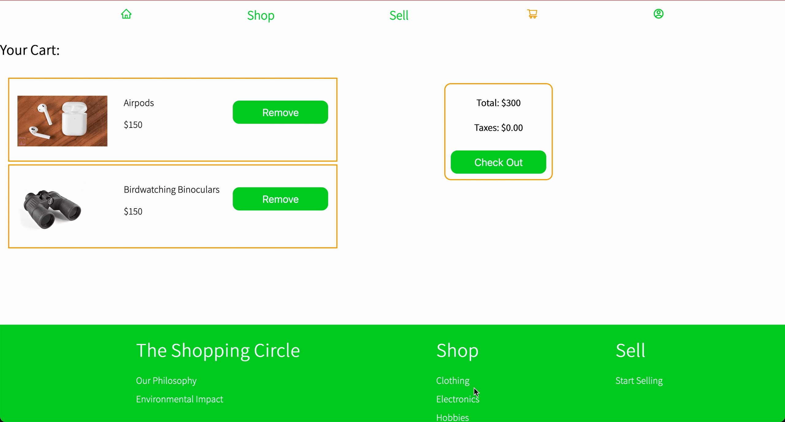

# The Shopping Circle

For my final project at the Concordia University Bootcamps Full-Stack Web Development course, I created an app similar to Facebook Marketplace called the Shopping Circle. This website allows you to buy or sell used items instead of throwing them away.

## Technologies Used:

Frontend: 1. React.js 2. Redux.js

Backend: 1. Node.js 2. Express

Database: 1. MongoDB

## Features:

### Shopping:

The Shopping Homepage features a product grid of all available products. There is the option to search the items by category; for example, you can look at all clothing products or all electronics.

You can see more details about each product by clicking on the product

You can then purchase the product and view your cart

### Selling:

The Selling Homepage explains how selling on the site works, gives links to individual seller profiles, and offers the option to sign up for a new account or log into an existing account

When you view a seller's profile, you can see their name and what items they have on sale

You can also create a new account or log into an existing account

### Checkout:

You can purchase items through the site. There is a form validation that makes sure all fields are filled out.

### Other Features:

The site changes depending on whether you are logged in as a buyer or a seller. The main difference is in the navigation bar and the look of the homepage

#### Homepage for a Seller Account

#### Homepage for a Buyer Account

You can also:

- Update your account information
- Delete your account
- If you have a seller account, you can add, update, or delete items for sale
